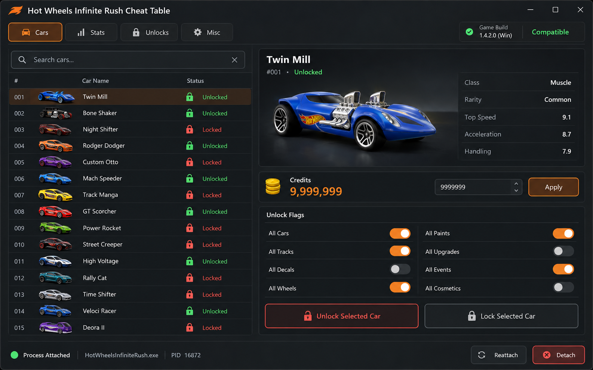

# Hot Wheels Infinite Rush: referência de Cheat Table

Confira a versão do jogo, os tipos de valores e as notas da tabela Cheat Engine antes de qualquer teste offline de memória.

<a href="./README.md">English</a> · <a href="./README_ES.md">Español</a> · <a href="./README_PT.md">Português</a> · <a href="./README_DE.md">Deutsch</a> · <a href="./README_FR.md">Français</a> · <a href="./README_CN.md">简&#8288;体&#8288;中&#8288;文</a> · <a href="./README_TW.md">繁&#8288;體&#8288;中&#8288;文</a> · <a href="./README_JP.md">日&#8288;本&#8288;語</a> · <a href="./README_KR.md">한&#8288;국&#8288;어</a>

  

## Por que esta ferramenta existe

Os dados de desbloqueio e os ponteiros de memória podem mudar entre as versões do jogo. A tabela mostra o processo anexado, a compilação detectada e o estado da opção juntos, o que torna óbvia uma versão incompatível antes que um valor seja aplicado.

## O que ele faz

### 01 · referência de bandeira de desbloqueio de carro

Compara o processo anexado e o conjunto de ponteiros com a construção do jogo selecionada.

### 02 · créditos e verificações de valor monetário

Agrupa opções com seu valor atual, estado e tecla de atalho em uma tela.

### 03 · notas de compatibilidade de construção de jogos

Mantém notas de compatibilidade e restaura informações ao lado de cada alteração arriscada.

## Feito para

- Verifique a compatibilidade de compilação
- Revise as dicas de opções
- Mantenha as alterações off-line reversíveis

## Conheça a interface

- **01.** Barra de processos com executável, PID e compilação detectada.
- **02.** Lista de carros com pesquisa, estado de bloqueio e veículo selecionado.
- **03.** Painel de valores para créditos e outros contadores suportados.
- **04.** Desbloqueie grupos de bandeiras para carros, pistas, atualizações e cosméticos.
- **05.** Notas de compatibilidade e restauração ao lado dos controles de aplicação.

## Antes de começar

- Deixe **Build + processo detectado** pronto e confirme que pertence ao perfil ou sessão de Hot Wheels Infinite Rush desejado.
- Anote a build atual do jogo/cliente ou a data dos dados antes de alterar um perfil.
- Escolha onde **Perfil da tabela e notas de restauração** será salvo para não substituir o resultado anterior.
- Teste **referência de bandeira de desbloqueio de carro** primeiro em uma sessão curta e mantenha o save, perfil ou comparação original ao lado.

## Visão rápida

| Recurso | Resultado |
|---|---|
| **Entrada** | Build + processo detectado |
| **Resultado** | Estados de opções compatíveis |
| **Saída** | Perfil da tabela e notas de restauração |

## Como interpretar o resultado

Um estado de opção verde importa apenas quando o processo, a construção do jogo e o conjunto de ponteiros também correspondem. Se uma opção mudar na mesa, mas não no jogo, trate isso como um problema de compatibilidade em vez de aumentar o valor. Teste as opções persistentes e de cena local separadamente porque o jogo pode reescrevê-las em momentos diferentes.

## Primeira execução completa

1. Abra **Hot Wheels Infinite Rush: referência de Cheat Table** e confira a build ou a fonte de dados de Hot Wheels Infinite Rush.
2. Escolha a entrada ou o perfil e ajuste **referência de bandeira de desbloqueio de carro** sem alterar os padrões que não fazem parte do teste.
3. Confira **créditos e verificações de valor monetário** na prévia ou no painel de status e corrija alertas de versão, filtro ou detecção.
4. Execute uma ação controlada. Compare o resultado visível com a prévia antes de mudar outro ajuste.
5. Salve o perfil ou exporte o resultado, mantendo **notas de compatibilidade de construção de jogos** disponível para comparação e recuperação.

## Solução de problemas

> **Falha comum:** a tabela do Cheat Engine para de funcionar após uma atualização.

### As opções não mostram nenhum efeito

Compare a compilação detectada com o ponteiro definido e reconecte depois que o jogo atingir o estado offline esperado.

### O processo não será anexado

Combine os níveis de privilégio e verifique o nome do executável mostrado na barra de processo.

### Um valor é redefinido

Verifique as notas de mudança de cena; alguns valores são reescritos pelo jogo e precisam de uma opção de persistência compatível.

## Depois de uma atualização do jogo

- [ ] Combine a nova compilação executável com uma versão da tabela antes de anexar.
- [ ] Trate a integridade desconhecida do ponteiro como incompatível, mesmo que o processo seja detectado.
- [ ] Teste uma opção off-line reversível antes dos valores de moeda, desbloqueio ou progressão.
- [ ] Mantenha o log anterior de salvamento e compatibilidade até que uma reinicialização limpa seja bem-sucedida.

## Perguntas frequentes

<strong>Por que a construção exata do jogo é importante?</strong>

Os ponteiros podem se mover após uma atualização. O painel de compatibilidade evita que uma compilação incomparável pareça um conjunto de opções funcionais.

<strong>O que incluir no registro de compatibilidade?</strong>

Anote a versão exata do jogo e da ferramenta ou dados, a entrada usada e o resultado observado. Identifique campos desconhecidos; um teste em outra versão não comprova a atual.

<strong>Há um executável ou script funcional incluído?</strong>

O repositório contém documentação e um conceito de interface, não uma versão funcional verificada. Notas e imagens não são testes de execução nem comprovam autoria oficial, compatibilidade ou proteção da conta.

## Dados e recuperação

Use tabelas de opções em estado offline e mantenha o salvamento ou configuração original fora da pasta de trabalho. Reconecte somente depois que o status da compilação for confirmado.

Use automação e modificações apenas quando as regras do jogo e o tipo de sessão permitirem.

---

## Baixar

Confira o escopo e a compatibilidade documentados antes de escolher uma versão.

---

Conceito de interface gerado por IA; uma versão funcional ainda não foi verificada.

